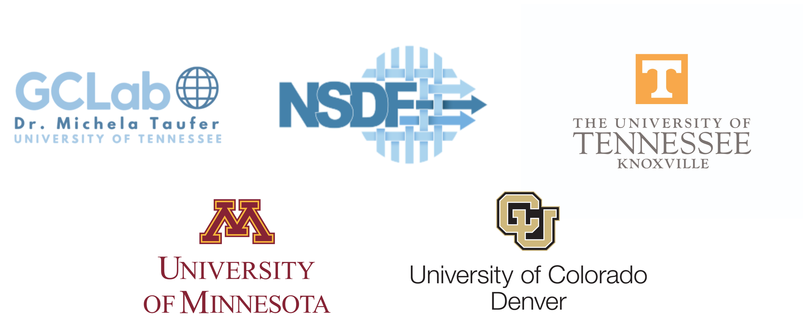

    

  <h1>NSDF Dark Matter Initiative</h1>

 

  
  
  
   

## Overview

The **NSDF Dark Matter Initiative** delivers state-of-the-art tools for accessing and analyzing dark matter data, including a web-based event visualization [dashboard](./dashboard), a [command-line interface](./nsdf_dark_matter_cli) (CLI) for data access,
and a [library](./nsdf_dark_matter) for data manipulation. By combining ease of access with scientific depth, the initiative empowers the community to accelerate discovery in dark matter research.

## ⚡Quick Start

To get up and running quickly, follow the step-by-step guides found in the [NSDF Dark Matter documentation](https://nsdf-fabric.github.io/nsdf-slac/)

## 🚀 Features

- **Web-based visualization:** Explore midas files, isolate detector channels, and examine detailed metadata such as trigger types and timestamps, all within the browser with the [NSDF Dark Matter Dashboard](https://services.nationalsciencedatafabric.org/darkmatter).
- **Easy data access via CLI**: Effortlessly search, and download dark matter data files using the [NSDF Dark Matter CLI](./docs/cli.md).
- **Workflow integration**: Leverage [NSDF Dark Matter Library](./docs/library.md) to load and manipulate dark matter data, enabling seamless integration into workflow pipelines, including machine learning.
- **Search events**: Search for specific events using the autocomplete input.
- **Visualization**: Visualize channel waveforms from multiple detectors.
- **Channel isolation**: Select or deselect channels from one or more detectors.
- **Event metadata**: View information about the trigger type, readout type, and timestamp of the events.

## ⚙️Workflow Suite

### 📊 NSDF Dark Matter Dashboard

The [NSDF Dark Matter Dashboard](https://services.nationalsciencedatafabric.org/darkmatter) provides a web-based interface to visualize and explore dark matter data all within the browser. Learn about the controls that make the dashboard from [dashboard guide](./docs/dashboard.md).

### 🖥️ NSDF Dark Matter CLI

The [NSDF Dark Matter CLI](./nsdf_dark_matter_cli) offers a pool of operations to access the R76 dark matter dataset. The CLI can be used as part of a workflow to download data which can
then be analyzed with the [NSDF Dark Matter Library](https://github.com/nsdf-fabric/nsdf-slac/tree/main/nsdf_dark_matter). Learn about the CLI from [CLI guide](./docs/cli.md).

### 📚 NSDF Dark Matter Library

The [NSDF Dark Matter Library](./nsdf_dark_matter) offers a pool of operations to manipulate dark matter data from getting event metadata to detector channel data acquisition. Learn about the library usage in [library guide](./docs/library.md).

## 🤝 Contributing

Contributions are always welcome, no matter how large or small. Read our [contributing guide](https://nsdf-fabric.github.io/nsdf-slac/contributing/) to learn on how you can start to contribute to the NSDF Dark Matter Initiative.

## Related Publications

- Michela Taufer, Heberth Martinez, Aashish Panta, Paula Olaya, Jack Marquez, Amy Gooch, Giorgio Scorzelli and Valerio Pascucci. ‘Leveraging National Science Data Fabric Services to Train Data Scientists’. In: Proceedings of the 2024 Workshop on Education for High-Performance Computing (EduHPC)-Workshops of The International Conference on High Performance Computing, Network, Storage, and Analysis (SC24). Atlanta, GA, USA: IEEE Computer Society, 2024, https://doi.ieeecomputersociety.org/10.1109/SCW63240.2024.00053.
- Paula Olaya, Jakob Luettgau, Camila Roa, Ricardo Llamas, Rodrigo Vargas, Sophia Wen, I-Hsin Chung, Seetharami Seelam, Yoonho Park, Jay Lofstead, and Michela Taufer. Enabling Scalability in the Cloud for Scientific Workflows: An Earth Science Use Case. In Proceedings of IEEE CLOUD, pages 1–10, Chicago, IL, USA, June 2023. IEEE Computer Society, https://doi.org/10.1109/CLOUD60044.2023.00052.
- Laboy, Gabriel; Ashworth, Jay; Olaya, Paula; Martinez, Heberth; Marquez, Jack; Panta, Aashish; Scorzelli, Giorgio; Taufer, Michela; Pascucci, Valerio, 2024, "NSDF OpenVisus Tutorial - GEOtiled Terrain Parameters", https://doi.org/10.7910/DVN/B33F4X, Harvard Dataverse, V1.
- Llamas, R., L. Valera, P. Olaya, M. Taufer, R. Vargas (2022). 1-km soil moisture predictions in the United States with SOMOSPIE, HydroShare, https://doi.org/10.4211/hs.79162a679f8a4273be582561a5504f68.

## Copyright and License

Copyright (c) 2025, NSDF

The NSDF SLAC dashboard is distributed under terms of the [Apache License, Version 2.0](http://www.apache.org/licenses/LICENSE-2.0) with LLVM Exceptions.

See [LICENSE](./LICENSE) for more details.

## Acknowledgments

This research is supported by the National Science Foundation (NSF) awards #2138811, #2103845, #2334945, #2138296, and #2331152. The work presented here is partly obtained using resources from ACCESS TG-CIS210128. We thank the Scientist Cloud Storage.
