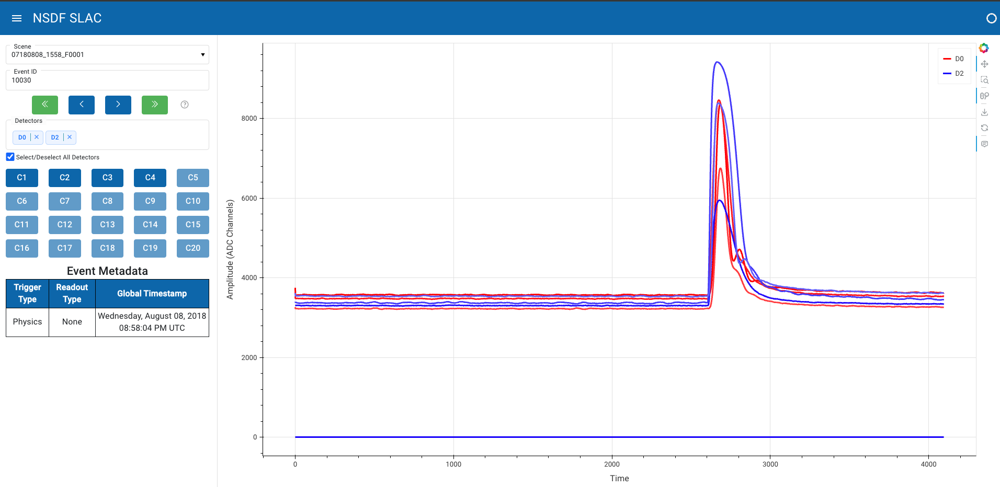

<div align="center">
  <h1>NSDF SLAC Dashboard</h1>
  <strong>Dashboard of NSDF SLAC</strong>
  <br>
</div>
<br>
<p align="center">
  
  <a href="https://github.com/nsdf-fabric/nsdf-slac/issues" style="text-decoration:none;">
    
  </a>
 
</p>

## Overview

The NSDF SLAC dashboard provides visualization for the detector channels of the SUPER CDMS DAQ data format.

## 🚀 Features

- **Explore .mid files**: Explore the events of .mid files in the browser with controls (first event, previous event, next event, last event).
- **Search events**: Search for specific events using the autocomplete input.
- **Visualization**: Visualize channel waveforms from multiple detectors.
- **Channel isolation**: Select or deselect channels from one or more detectors.
- **Event metadata**: View information about the trigger type, readout type, and timestamp of the events.

## 📄 Requirements

> If you already have Conda installed on your machine, skip to Installation.

To run the dashboard locally you will need to install [conda](https://docs.anaconda.com/miniconda/install/).

> ⚠️Caution
> Alternatively, you can use the following script to install Conda, but please note that it is provided "as-is" and might have some limitations.

```sh
chmod +x setup-conda.sh \
./setup-conda.sh
```

## 🖥️ Running the dashboard

### 💻 Locally (development)

- **Creating the environment**

To run the dashboard locally, you can use the following command to create a Conda environment with all necessary dependencies:

```sh
make create_env
```

Alternatively, if you prefer to run the commands manually, you can execute the following:

```sh
conda remove -n "slac" --all -y \
conda create -n "slac" python==3.10 -y \
conda run -n slac pip install -r requirements.txt
```

- **Development**

Once the Conda environment is created, activate it with the following command:

```sh
conda activate slac
```

Then, to open the dashboard in your browser, execute the following:

```sh
make dev
```

Alternatively, if you prefer to run the command manually, you can execute the following:

```sh
panel serve slac.py --dev --show
```

### 🐳 Docker

Docker can be used as an alternative method for running and deploying the dashboard. Ensure you have installed [Docker](https://www.docker.com/get-started/) and that the Docker daemon is running on your machine.

- **Building the image**

To build the Docker image, run the following:

```sh
make build
```

Alternatively, if you prefer to run the command manually, you can execute the following:

```sh
docker build . -t dashboard -f Dockerfile
```

- **Running the container**

To run the Docker container, execute the following:

```sh
make run
```

Alternatively, if you prefer to run the command manually, you can execute the following:

```sh
docker run --rm -p 10325:10325 dashboard
```

## 📝 Docs

[Dashboard.md](./docs/dashboard.md): In depth docs on each component from the dashboard.

## Copyright and License

See [LICENSE](./LICENSE) for more details.
