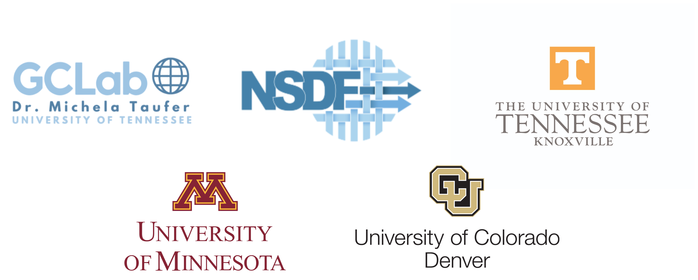

<p align="center">
    
</p>

<div align="center">
  <h1>NSDF Dark Matter Initiative</h1>
</div>
<br>
<p align="center">
  <a href="https://github.com/nsdf-fabric/nsdf-slac/issues" style="text-decoration:none;">
    
  </a>
 
</p>

## Overview

The **NSDF Dark Matter Initiative** delivers state-of-the-art tools for accessing and analyzing dark matter data, including a web-based event visualization dashboard and a command-line interface (CLI) for streamlined data download. Researchers can interactively explore .mid files, isolate detector channels, and examine detailed metadata such as trigger types and timestamps—all within the browser. By combining ease of access with scientific depth, the initiative empowers the community to accelerate discovery in dark matter research.


## 🚀 Features

- **Explore .mid files**: Explore the events of .mid files in the browser with controls (first event, previous event, next event, last event).
- **Search events**: Search for specific events using the autocomplete input.
- **Visualization**: Visualize channel waveforms from multiple detectors.
- **Channel isolation**: Select or deselect channels from one or more detectors.
- **Event metadata**: View information about the trigger type, readout type, and timestamp of the events.
- **Easy data access via CLI**: Effortlessly search, and download dark matter data files using the CLI.
- **Workflow integration**: Leverage `idx_lib` to load and manipulate dark matter data in .idx format, enabling seamless integration into analysis pipelines and machine learning workflows.

## 📄 Requirements

> If you already have Conda installed on your machine, skip to running the dashboard.

To run the dashboard locally you will need to install [conda](https://docs.anaconda.com/miniconda/install/).

> [!WARNING]
> Alternatively, you can use the following script to install Conda, but please note that it is provided "as-is" and might have some limitations.

```bash
chmod +x setup-conda.sh &&
./setup-conda.sh
```

## 🖥️ Running the dashboard

> **_NOTE:_** for the following use tag [v.0.0.1](https://github.com/nsdf-fabric/nsdf-slac/tree/v0.0.1)

### 💻 Locally (development)

#### Creating the environment

To run the dashboard locally, you can use the following command to create a Conda environment with all necessary dependencies:

```bash
make create_env
```

Alternatively, if you prefer to run the commands manually, you can execute the following:

```bash
conda remove -n "slac" --all -y &&
conda create -n "slac" python==3.10 -y &&
conda run -n slac pip install -r requirements.txt
```

#### Development

Once the Conda environment is created, activate it with the following command:

```bash
conda activate slac
```

Then, to open the dashboard in your browser, execute the following:

```bash
make dev
```

Alternatively, if you prefer to run the command manually, you can execute the following:

```bash
panel serve slac.py --dev --show
```

### 🐳 Docker

Docker can be used as an alternative method for running and deploying the dashboard. Ensure you have installed [Docker](https://www.docker.com/get-started/) and that the Docker daemon is running on your machine.

#### Building the image

To build the Docker image, run the following:

```bash
make build
```

Alternatively, if you prefer to run the command manually, you can execute the following:

```bash
docker build . -t dashboard -f Dockerfile
```

#### Running the container

To run the Docker container, execute the following:

```bash
make run
```

Alternatively, if you prefer to run the command manually, you can execute the following:

```bash
docker run --rm -p 10202:10202 dashboard
```

## 📝 Docs

[Dashboard.md](./docs/dashboard.md): Docs on each component from the dashboard.

## Related Publications

- Michela Taufer, Heberth Martinez, Aashish Panta, Paula Olaya, Jack Marquez, Amy Gooch, Giorgio Scorzelli and Valerio Pascucci. ‘Leveraging National Science Data Fabric Services to Train Data Scientists’. In: Proceedings of the 2024 Workshop on Education for High-Performance Computing (EduHPC)-Workshops of The International Conference on High Performance Computing, Network, Storage, and Analysis (SC24). Atlanta, GA, USA: IEEE Computer Society, 2024, https://doi.ieeecomputersociety.org/10.1109/SCW63240.2024.00053.
- Paula Olaya, Jakob Luettgau, Camila Roa, Ricardo Llamas, Rodrigo Vargas, Sophia Wen, I-Hsin Chung, Seetharami Seelam, Yoonho Park, Jay Lofstead, and Michela Taufer. Enabling Scalability in the Cloud for Scientific Workflows: An Earth Science Use Case. In Proceedings of IEEE CLOUD, pages 1–10, Chicago, IL, USA, June 2023. IEEE Computer Society, https://doi.org/10.1109/CLOUD60044.2023.00052.
- Laboy, Gabriel; Ashworth, Jay; Olaya, Paula; Martinez, Heberth; Marquez, Jack; Panta, Aashish; Scorzelli, Giorgio; Taufer, Michela; Pascucci, Valerio, 2024, "NSDF OpenVisus Tutorial - GEOtiled Terrain Parameters", https://doi.org/10.7910/DVN/B33F4X, Harvard Dataverse, V1.
- Llamas, R., L. Valera, P. Olaya, M. Taufer, R. Vargas (2022). 1-km soil moisture predictions in the United States with SOMOSPIE, HydroShare, https://doi.org/10.4211/hs.79162a679f8a4273be582561a5504f68.

## Copyright and License

Copyright (c) 2025, NSDF

The NSDF SLAC dashboard is distributed under terms of the [Apache License, Version 2.0](http://www.apache.org/licenses/LICENSE-2.0) with LLVM Exceptions.

See [LICENSE](./LICENSE) for more details.

## Acknowledgments

This research is supported by the National Science Foundation (NSF) awards #2138811, #2103845, #2334945, #2138296, and #2331152. The work presented here is partly obtained using resources from ACCESS TG-CIS210128. We thank the Dataverse, and Seal Storage.
