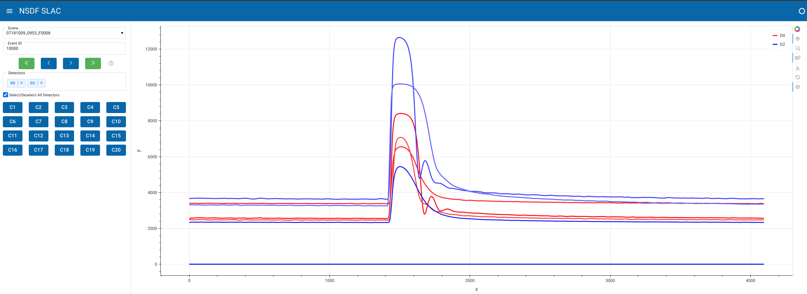

# 📈 Channels Dashboard

This is a prototype of the channel selection dashboard in Panel. It has the following capabilities:

- Explore events in a .mid file with controls (first event, previous event, next event, last event)
- Search for an specific event with autocomplete input. 
- Configure for zero, one, or multiple detectors in a plot.
- Select/Deselect a channel.
- Bokeh plot updates based on controls
