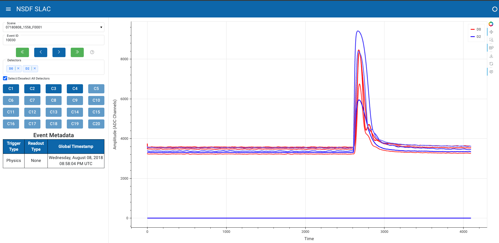

# NSDF Dark Matter Dashboard

The [NSDF Dark Matter dashboard](https://services.nationalsciencedatafabric.org/darkmatter) is a web-based visualization tool for the R76 dark matter dataset.

## 🚀 Features

- **Explore .mid files**: Explore the events of .mid files in the browser with controls (first event, previous event, next event, last event).
- **Search events**: Search for specific events using the autocomplete input.
- **Visualization**: Visualize channel waveforms from multiple detectors.
- **Channel isolation**: Select or deselect channels from one or more detectors.
- **Event metadata**: View information about the trigger type, readout type, and timestamp of the events.
