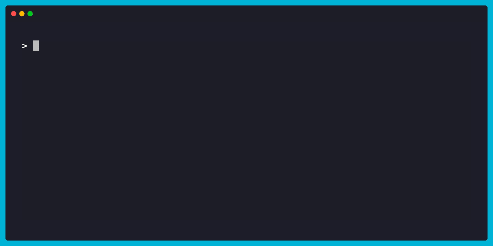
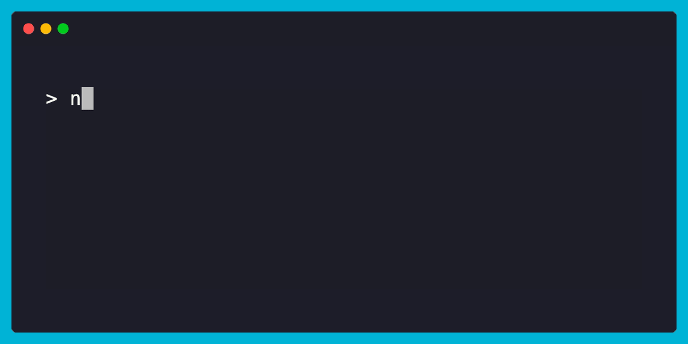
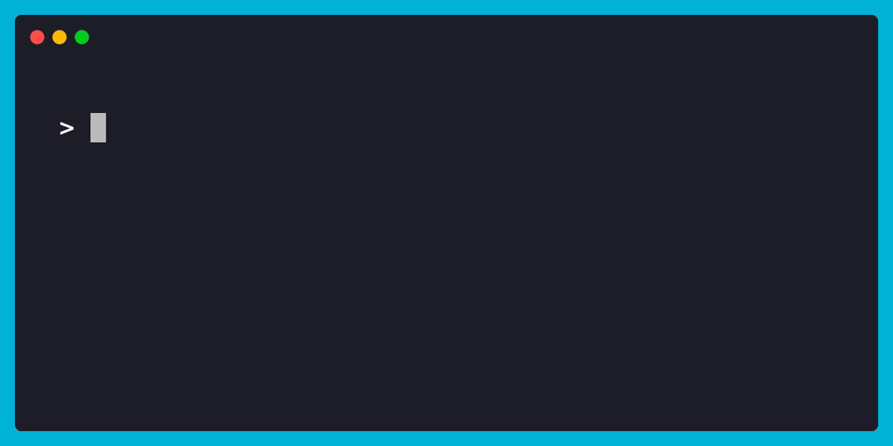
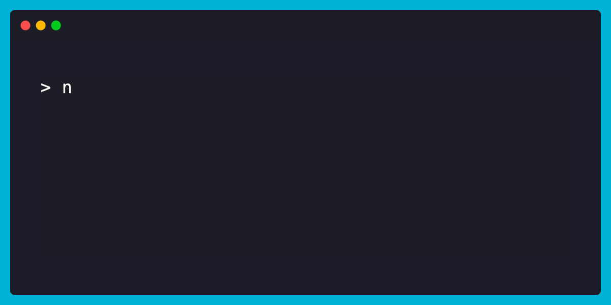

# NSDF Dark Matter CLI



The `NSDF Dark Matter CLI` offers a pool of operations to access and download dark matter datasets. The CLI serves as a top level component in a workflow to download data which can
then be analyzed with the [NSDF Dark Matter Library](./library.md)

## 🚀 Getting Started

!!! info "Virtual Environment"

    To begin, make sure you have Python 3.10 or higher installed on your machine. You can download it from the official website: [Install Python](https://www.python.org/downloads/).

    In this guide, we will be using [uv](https://docs.astral.sh/uv/) to manage a virtual environment. You can install `uv` by following this [installation guide](https://docs.astral.sh/uv/getting-started/installation/).

!!! note

    If you prefer, you can use a different environment manager such as [conda](https://www.anaconda.com/docs/getting-started/miniconda/main) or Python's built-in [venv](https://docs.python.org/3/library/venv.html)

### Creating the environment

To create a new virtual environment, run the following command in your terminal:

=== "uv (recommended)"

    !!! info "uv (recommended)"

        ```bash
        uv venv darkmatter_cli_env --python 3.10
        ```

=== "Conda"

    !!! info "Conda"

        ```bash
        conda create -n darkmatter_cli_env python=3.10
        ```

=== "Python venv"

    !!! info "Python venv"

        ```bash
        python -m venv darkmatter_cli_env
        ```

### Activating the environment

Next, we activate the environment:

=== "uv (recommended)"

    !!! info "uv (recommended)"

        ```bash
        source darkmatter_cli_env/bin/activate
        ```

=== "Conda"

    !!! info "Conda"

        ```bash
        conda activate darkmatter_cli_env
        ```

=== "Python venv"

    !!! info "Python venv"

        ```bash
        source darkmatter_cli_env/bin/activate
        ```

---

You should now see the environment name in your terminal prompt, indicating it’s active.

### Installing the CLI

#### pip (recommended)

To install the CLI via pip, run the following command.

!!! info "CLI pip installation"

    ```bash
    pip install nsdf-dark-matter-cli
    ```

#### From release

To install the CLI from releases, download the `wheel` file.

```bash
wget https://github.com/nsdf-fabric/nsdf-slac/releases/download/v0.1.0/nsdf_dark_matter_cli-0.1.0-py3-none-any.whl
```

Now, we can install the CLI by passing the wheel file with the following command:

=== "uv (recommended)"

    !!! info "uv (recommended)"

        ```bash
        uv pip install nsdf_dark_matter_cli-0.1.0-py3-none-any.whl
        ```

=== "Conda"

    !!! info "Conda"

        ```bash
        pip install nsdf_dark_matter_cli-0.1.0-py3-none-any.whl
        ```

=== "Python venv"

    !!! info "Python venv"

        ```bash
        pip install nsdf_dark_matter_cli-0.1.0-py3-none-any.whl
        ```

---

That's it! The CLI is now installed and ready to use. We can start working with it.

## 🖥️ The NSDF Dark Matter CLI

To explore all available CLI commands and options, run the following help command:

```bash
nsdf-cli --help
```


### Listing remote files

Want to know what files are available to download? Use the ls command to list them. You can also limit how many results you see by passing the `--limit` flag.

```bash
nsdf-cli ls --limit 5
```



Looking for something specific? Use the `--prefix` flag to filter files by name:

```bash
nsdf-cli ls --prefix 072 --limit 5
```



Great! we have found files from the **R76** dataset.

### Downloading a dataset locally

Once you've found the file you want, downloading it is easy with the `download` command:

```bash
nsdf-cli download 07180827_0000_F0001
```



Downloaded files go into the idx directory, and each one gets its own subfolder based on the `mid_id`. After downloading a few datasets, your folder might look like this:

```console
idx/
   |
   07180925_0000_F0001/
   |
   07181007_0000_F0001/
   |
   07180916_0000_F0002/
```

A `mid_id` directory is composed of the following files:

```console
07180925_0000_F0001/
                   |
                   07180827_0000_F0001.csv
                   |
                   07180827_0000_F0001.txt
                   |
                   07180827_0000_F0001.idx
                   |
                   07180925_0000_F0001/
                                      |
                                      0000.bin
```

## Next Steps

Now that you have some data, it’s time to dive into analysis! Head over to the [NSDF Dark Matter Library guide](./library.md) to learn how to start working with the dataset.
