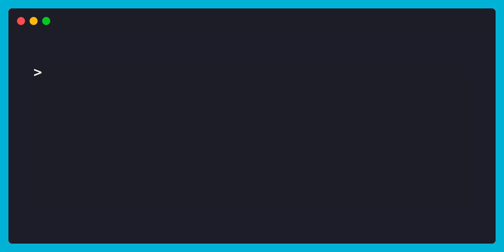

# NSDF Dark Matter CLI

The `nsdf_dark_matter` CLI offers a pool of operations to access and download the R68 dark matter dataset. The CLI serves as a top level component in a workflow to download data which can
then be analyzed with the [NSDF Dark Matter Library](https://github.com/nsdf-fabric/nsdf-slac/tree/main/nsdf_dark_matter)

## Getting Started

To explore all available CLI commands and options, run the following help command:


### Listing remote files

Want to know what files are available to download? Use the ls command to list them. You can also limit how many results you see by passing the `--limit` flag.



```bash
nsdf-cli ls --limit 5
```

Looking for something specific? Use the `--prefix` flag to filter files by name:

```bash
nsdf-cli ls --prefix 07180928_2310
```

### Downloading a dataset locally

Once you've found the file you want, downloading it is easy with the `download` command:


```bash
nsdf-cli download 07180827_0000_F0001
```

Downloaded files go into the idx directory, and each one gets its own subfolder based on the mid_id. After downloading a few datasets, your folder might look like this:

```console
idx/
   |
   07180925_0000_F0001/
   |
   07181007_0000_F0001/
   |
   07180916_0000_F0002/
```

## What's Next?

Now that you have some data, it’s time to dive into analysis! Head over to the [NSDF Dark Matter Library](https://github.com/nsdf-fabric/nsdf-slac/tree/main/nsdf_dark_matter) to learn how to start working with the dataset.
