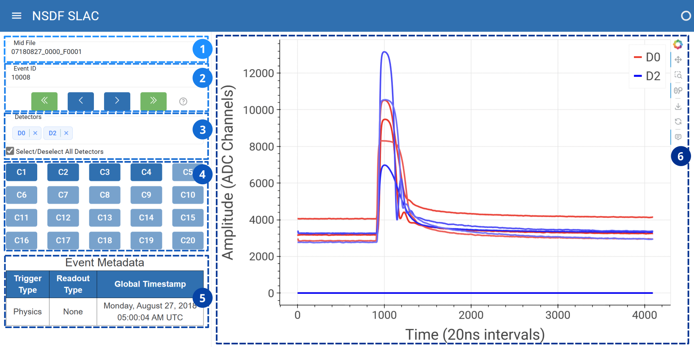
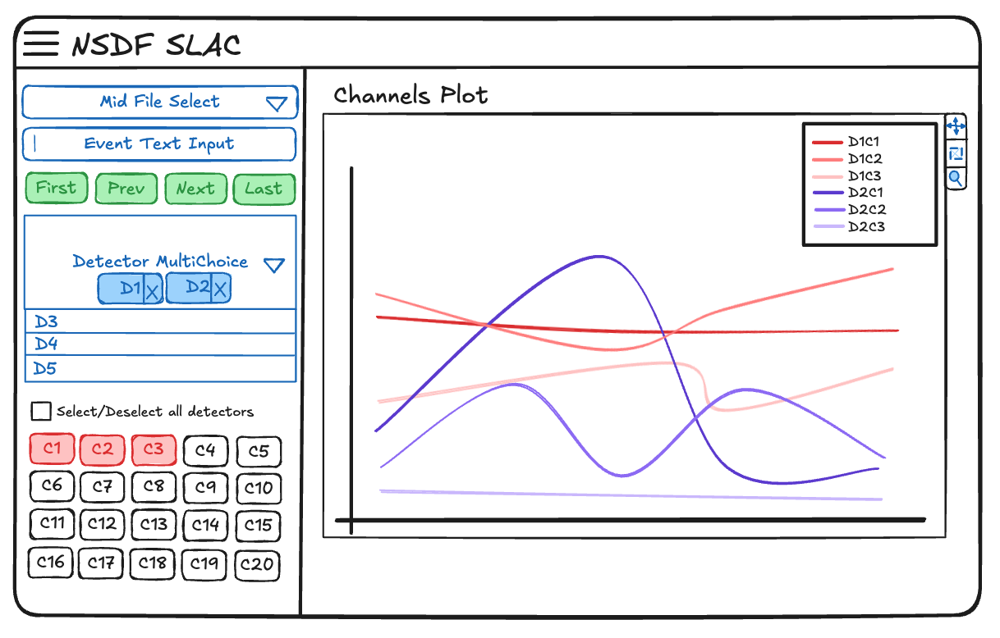
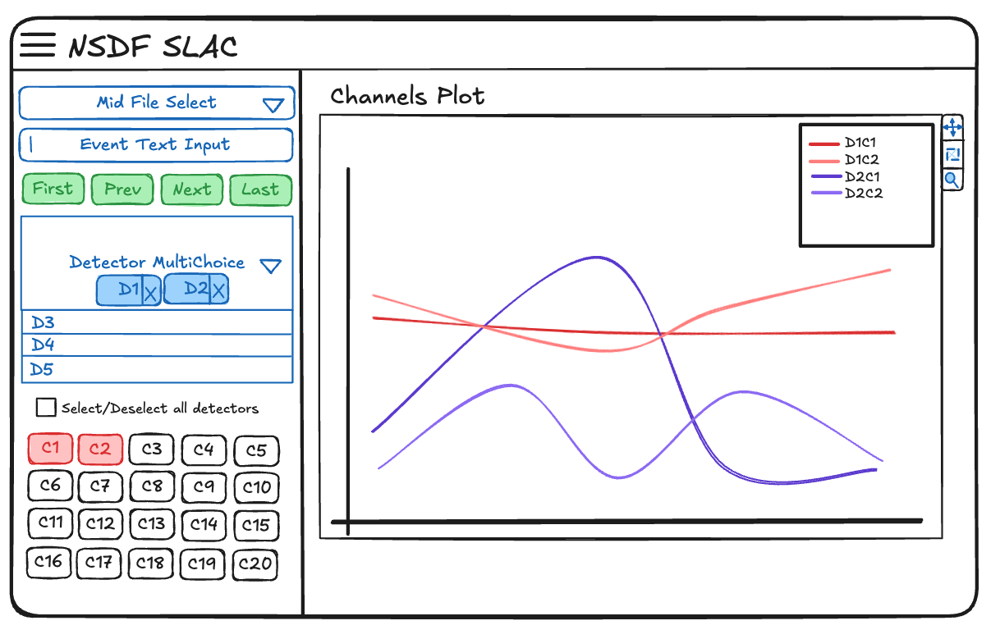
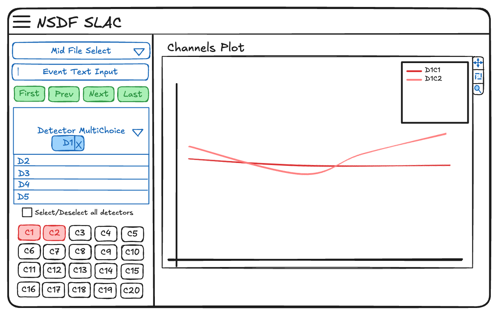

# NSDF Dark Matter Dashboard

<figure>
<figcaption>
(1) allows file selection and control (2) allows event selection. Control (3) filters data by electronics readout boards, and control (4) selects individual channels. Table (5) shows event metadata, and plot (6) provides an interactive view of pulse shapes
</figcaption> 
</figure>

The [NSDF Dark Matter Dashboard](https://services.nationalsciencedatafabric.org/darkmatter) provides a way to visualize the **SuperCDMS DAQ data** format and follows the event structure defined by [Midas](https://daq00.triumf.ca/MidasWiki/index.php/Event_Structure). The dashboard is made up of multiple components and is divided into two main sections: the sidebar controls and the channels plot.

## ☰ Sidebar controls

The controls located in the left sidebar manipulate the display of the channels plot section. The following components are part of the sidebar controls: the mid file selector, event text input, event controls, detector section, channel button grid, and event metadata table.

### Mid File Selector

The mid file selector allows the user to select a specific mid file record from the storage. After selecting a mid file, the event text input becomes available.

### Event text input

The event text input facilitates navigation through the different events as specified by the **SuperCDMS DAQ data format**. The user can search an specific event by typing the eventID number.

### Event controls

The event controls provide an alternative way to navigate through events in order. It consists of four buttons: first event, previous event, next event, and last event. When used in combination with the event text input, these buttons also allow navigation with respect to the eventID selected.

### Detector section

The detector multichoice allows the user to select the detectors of interest for a specific event. By selecting or deselecting a detector, the channels plot on the right updates accordingly (with all detectors selected by default). A checkbox is provided to enable or disable all detectors at once.

### Channel button grid

The channel button grid corresponds to the 20 possible channels that a detector might have (all selected by default). When clicked, it will toggle the inclusion of channels from the selected detectors, either displaying or hiding them on the channels plot.

### Event metadata table

The event metadata table dynamically displays the trigger type, readout type, and global timestamp associated with an eventID.

## 📈 Channels plot section

The section of the right displays the channels in a plot, and updates dynamically depending on the controls selected. A typical workflow might look like this:

The user starts with 2 detectors (D1, D2), and has 3 channels selected (C1,C2,C3). Therefore, the channels plot shows (D1C1, D1C2, D1C3, D2C1, D2C2, D2C3).

After, the user deselects C3 on the channel button grid, it removes the associated channel C3 from the detectors, resulting in plot (D1C1,D1C2, D2C1,D2C2).

Lastly, the user removes D2 from the multichoice detector, resulting in the plot (D1C1,D1C2). The channels of a detector are represented by a gradient of a color.
