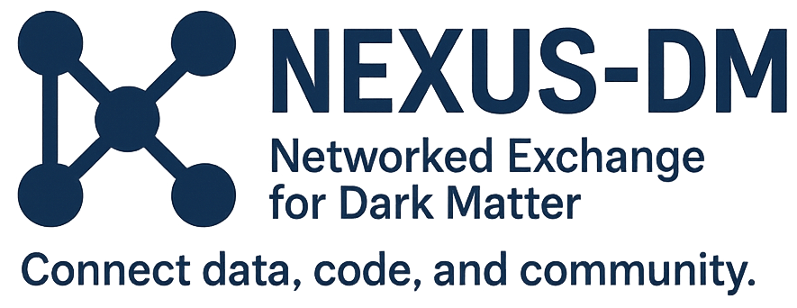

# Nexus-DM Documentation

**Nexus-DM** is a collaborative initiative between the [National Science Data Fabric](https://nationalsciencedatafabric.org/) (NSDF) and partner institutions, including the [University of Colorado Denver](https://clas.ucdenver.edu/physics/amy-roberts-phd) and the University of Minnesota. The project delivers an integrated suite of tools for accessing, visualizing, and analyzing dark matter data. By combining ease of access with scientific depth, the initiative empowers the community to accelerate discovery in dark matter research.

To learn more about the background and goals of this effort, read our paper: _["The Making of a Community Dark Matter Dataset with the National Science Data Fabric"](https://arxiv.org/abs/2507.13297)_.

This set of guides is designed to help you interact and analyze dark matter datasets such as **R68** and **R76**, using our suite of tools. Whether you are just getting started or diving into advanced workflows, these instructions will walk you through installation, setup, and usage.

## ⚡Quick Start

- [🔧 CLI Guide](./cli.md): Learn how to access and download dark matter datasets using the `nsdf-cli` command-line interface.
- [📚 Library Guide](./library.md): Explore how to load and analyze a dark matter dataset using the Python API.
- [📊 Dashboard Guide](./dashboard.md): Understand the components of the web-based dashboard for visualizing dark matter events and detectors.

### Tutorials

- [Visualizing Pulses](./plotting_tutorial.md): Learn how to combine the CLI, and library to visualize event pulses with Matplotlib with this tutorial!

## 🚀 Features

- **Web-based visualization:** Explore midas files, isolate detector channels, and examine detailed metadata such as trigger types and time stamps, all within the browser with the [NSDF Dark Matter Dashboard](https://services.nationalsciencedatafabric.org/darkmatter).
- **Easy data access via CLI**: Effortlessly search, and download dark matter data files using the [NSDF Dark Matter CLI](./cli.md).
- **Workflow integration**: Leverage [NSDF Dark Matter Library](./library.md) to load and manipulate dark matter data, enabling seamless integration into workflow pipelines, including machine learning.
- **Search events**: Search for specific events using the autocomplete input.
- **Visualization**: Visualize channel waveforms from multiple detectors.
- **Channel isolation**: Select or deselect channels from one or more detectors.
- **Event metadata**: View information about the trigger type, readout type, and timestamp of the events.

## Next Steps

Start by exploring the [CLI Guide](./cli.md) to download data or visit the web-based [Dashboard](https://services.nationalsciencedatafabric.org/darkmatter)
to visualize the data.
