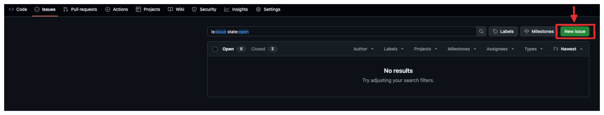
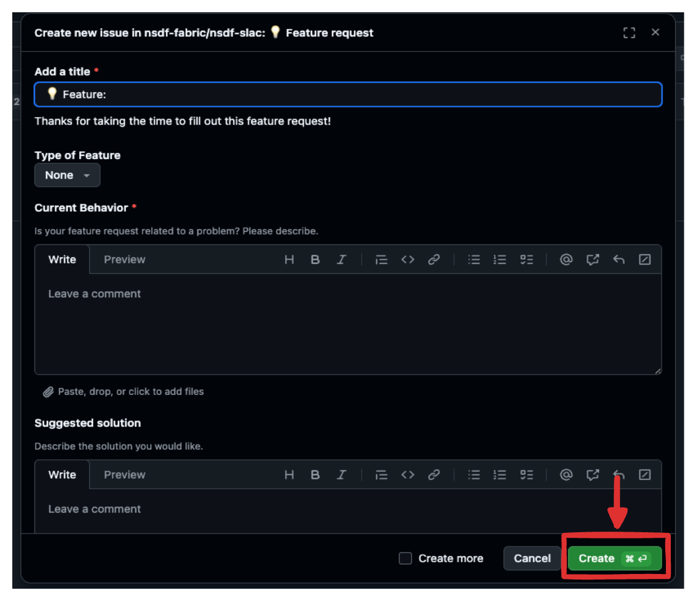

# Opening Issues

Do you have a feature in mind? or have you spotted a bug? issues can be opened on our repo here: [https://github.com/nsdf-fabric/nsdf-slac/issues](https://github.com/nsdf-fabric/nsdf-slac/issues). Below is a step by step guide
on how to file an issue.

!!! danger "reporting security vulnerabilities"

    **Do not report a security vulnerability in a public issue**, instead send your report privately to [info@nationalsciencedatafabric.org](mailto:info@nationalsciencedatafabric.org)

Before opening an issue, please search for **pre-existing issues** which may describe the problem you are having. This helps us track issues and develop solutions more efficiently.

## How to Open an Issue?

!!! note "1. Navigate to the Repository Link"

    First, you will need to navigate to the repository link here: [https://github.com/nsdf-fabric/nsdf-slac/issues](https://github.com/nsdf-fabric/nsdf-slac/issues). then, click on **new issue**.

    

!!! note "2. Selecting the Type of Issue"

    Next, select the type of issue you want to file.

    

    - **bug report**: select this option, if there is an error or malfunction in the existing artifacts.
    - **feature request**: select this option, if you would like to see a new feature, or enhance an existing feature.

!!! note "3. Submitting the Issue"

    Finally, fill out the template of the selected type of issue, and click on the **create button** to submit the issue.

    
