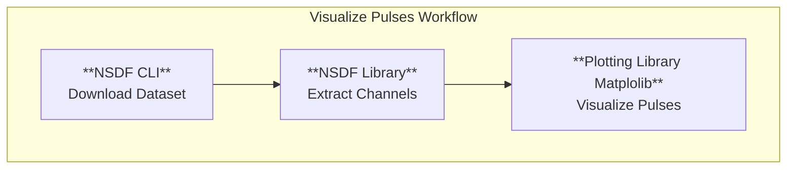
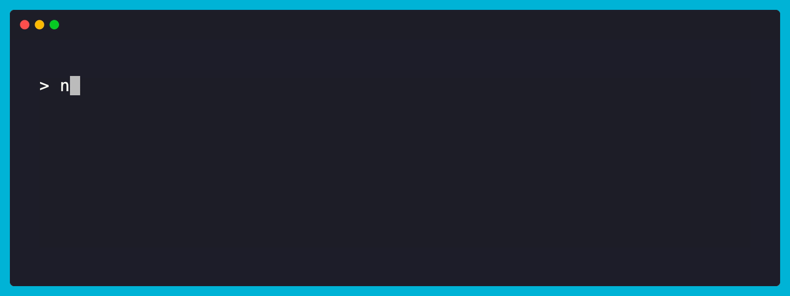
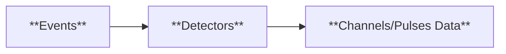
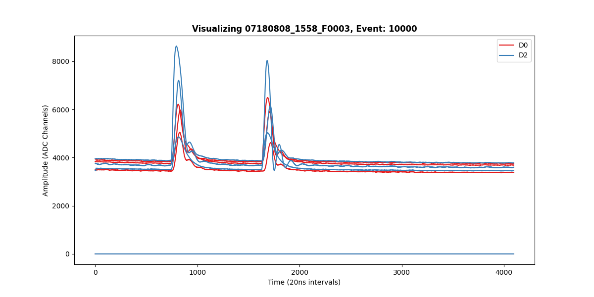

# **Visualizing Pulses Tutorial**

In this tutorial, we will walk through using the **NSDF CLI**, and the **NSDF Dark Matter Library** to
visualize pulses from events in a dataset.

!!! info "Virtual Environment"

    To begin, make sure you have Python 3.10 or higher installed on your machine. You can download it from the official website: [Install Python](https://www.python.org/downloads/).

    In this guide, we will be using [uv](https://docs.astral.sh/uv/) to manage a virtual environment. You can install `uv` by following this [installation guide](https://docs.astral.sh/uv/getting-started/installation/).

!!! note

    If you prefer, you can use a different environment manager such as [conda](https://www.anaconda.com/docs/getting-started/miniconda/main) or Python's built-in [venv](https://docs.python.org/3/library/venv.html)

## **Setting up the environment**

First, we need to set up our virtual environment, and install our dependencies. Here’s how:

=== "uv (recommended)"

    !!! info "uv (recommended)"

        ```bash
        uv venv dm_env --python 3.10
        ```

=== "Conda"

    !!! info "Conda"

        ```bash
        conda create -n dm_env python=3.10
        ```

=== "Python venv"

    !!! info "Python venv"

        ```bash
        python -m venv dm_env
        ```

Next, activate the environment:

=== "uv (recommended)"

    !!! info "uv (recommended)"

        ```bash
        source dm_env/bin/activate
        ```

=== "Conda"

    !!! info "Conda"

        ```bash
        conda activate dm_env
        ```

=== "Python venv"

    !!! info "Python venv"

        ```bash
        source dm_env/bin/activate
        ```

Finally, install the dependencies:

=== "uv (recommended)"

    !!! info "uv (recommended)"

        ```bash
        uv pip install nsdf-dark-matter-cli==0.3.1 nsdf-dark-matter==0.3.0 matplotlib
        ```

=== "Conda"

    !!! info "Conda"

        ```bash
        conda activate dm_env
        ```

=== "Python venv"

    !!! info "Python venv"

        ```bash
        source dm_env/bin/activate
        ```

!!! success "Completed Setting the Environment"

    We have successfully **set up the environment and installed the necessary dependencies.**

## **Visualizing Pulses**

A typical workflow to visualize pulses consists of three steps. A high-level overview looks like this:



### 1. Downloading a Dataset

First, fetch a dataset of interest using the **NSDF CLI**:

```bash
nsdf-cli download 07180808_1558_F0003
```



After downloading, the dataset files are stored in the **idx** directory.

```bash
ls idx
```


For a more detailed guide on the CLI, see the [NSDF CLI guide](./cli.md).

!!! success "Completed Downloading a Dataset"

    We have successfully **donwloaded a dataset**, let's move on to see how we can use the library to manipulate the data.

### 2. Extracting Channels

Now, we will create a simple program to **extract all the channels of a given event**. The typical hierarchy of data
is given as follows:

<figure markdown style="width:100%">



<figcaption>R76/R68 Data Hierarchy</figcaption>
</figure>

Let's keep this hierarchy in mind as we code our program.

First, import the necessary libraries and load the dataset:

```python
from nsdf_dark_matter.idx import load_all_data
import matplotlib.pyplot as plt

def main():
    # specify the path to the dataset you want to use
    cdms = load_all_data('./idx/07180808_1558_F0003')
```

Next, let's retrieve an event ID with the **get_event_ids** method. This is the first primitive
in the data hierarchy. In this case we will pick the **first event**.

```python
# get_event_ids retrieves a list of all the event ids, we pick the very first one
event_id = cdms.get_event_ids()[0] # event_id: 10000
```

We can now move on to retrieving the detector from the event. To do so, we pass in our **event_id**
into the **get_detectors_by_event** method.

```python
detector_ids = cdms.get_detectors_by_event(event_id) # ['10000_0_Phonon_4096', '10000_2_Phonon_4096']
```

A typical detector id looks like this **10000_0_Phonon_4096**, let's explain what each of these mean:

- 10000 (**event id**): This is the event id that this detector is part of.
- 0 (**detector number**): This is the detector number, depending on the number of detectors set you might see (0,1,2,3,4,5,6, etc)
- Phonon (**type**): This is the type of channel, the entire dataset is Phonon type.
- 4096 (**Number of samples per channel**): This is the number of samples per channel in the detector.

!!! NOTE

    Detector numbers are consistent across events. For example:

    - `10000_0_Phonon_4096` and `10000_1_Phonon_4096` refer to **the same event, and different detectors**.
    - `10000_0_Phonon_4096` and `10001_0_Phonon_4096` refer to **the same detector number** for different events.
    - `10000_0_Phonon_4096` and `10001_1_Phonon_4096` refer to **different detectors and different events**.

Let's get aggregate our channel data for the entire event in one list. We iterate through each of our detector ids and retrieve the channel data with **get_detector_channels** data.

```python
# Extracting all the channel data from each detector
channel_data = []
for det in detector_ids:
    channel_data.append(cdms.get_detector_channels(det))
```

!!! success "Completed Extracting Event Channels"

    We have successfully used the nsdf dark matter library to **extract all the channels of an event**.

### 3. Visualizing Pulses

Finally, we can use matplotlib to visualize the pulses.

```python
# Visualizing the pulses
plt.figure(figsize=(12, 6))
plt.title(f"Visualizing 07180808_1558_F0003, Event: {event_id}", fontweight="bold")
plt.xlabel("Time (20ns intervals)")
plt.ylabel("Amplitude (ADC Channels)")

cmap = plt.get_cmap('Set1')
for i, det_channels in enumerate(channel_data):
    for row in range(det_channels.shape[0]):
        label = f"D{detector_ids[i].split('_')[1]}" if row == 0 else None
        plt.plot(det_channels[row], color=cmap(i), label=label)

plt.legend()
plt.show()
```

We get the following plot:



If we take a look at the Nexus-DM dashboard, we see that we have the **same result!**


Let's render channels from another event, by changing our **event id**

```python
event_id = cdms.get_event_ids()[1008]
```


??? info "Complete Tutorial Code"

      ```python
      from nsdf_dark_matter.idx import load_all_data
      import matplotlib.pyplot as plt


      def main():
          # specify the path to the dataset you want to use
          cdms = load_all_data('./idx/07180808_1558_F0003')

          event_id = cdms.get_event_ids()[0]
          detector_ids = cdms.get_detectors_by_event(event_id)

          # Extracting all the channel data from each detector
          channel_data = []
          for det in detector_ids:
              channel_data.append(cdms.get_detector_channels(det))

          # Visualizing the pulses
          plt.figure(figsize=(12, 6))
          plt.title(f"Visualizing 07180808_1558_F0003, Event: {event_id}", fontweight="bold")
          plt.xlabel("Time (20ns intervals)")
          plt.ylabel("Amplitude (ADC Channels)")

          cmap = plt.get_cmap('Set1')
          for i, det_channels in enumerate(channel_data):
              for row in range(det_channels.shape[0]):
                  label = f"D{detector_ids[i].split('_')[1]}" if row == 0 else None
                  plt.plot(det_channels[row], color=cmap(i), label=label)

          plt.legend()
          plt.show()


      main()
      ```

!!! success "Completed Visualizing Pulses"

    Great, we can now visualize all the channels for any event in the dataset!

# Wrapping up

In this tutorial, you learned how to:

- Set up a Python environment and install dependencies to analyze dark matter datasets.

- Download datasets using the NSDF CLI.

- Extract channels from events using the NSDF Dark Matter Library.

- Visualize pulses of events using Matplotlib.

With these tools, you can explore and analyze any event in your dataset, compare visualizations across events, and integrate this workflow into larger analysis pipelines. This workflow provides a strong foundation for more advanced processing and analysis such as **machine learning workflows**.
